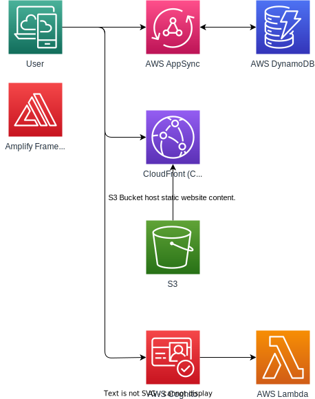

# WittyBanter - Real-time Chat Application - PoC

This is a proof of concept (PoC) project for a real-time chat application built using AWS services. The backend is
powered by AWS AppSync as a GraphQL service, and AWS Cognito provides authentication and authorization. The database
backend is managed by DynamoDB. The front end is built with React and TypeScript.

## Architecture

## Features

- Real-time chat: Users can send and receive messages in real-time.
- Authentication: Users are required to log in to the application using AWS Cognito.
- Authorization: AWS Cognito is used to control access to the application and its features.
- GraphQL API: The backend is powered by AWS AppSync, which provides a GraphQL API for the front end.
- DynamoDB backend: The application uses DynamoDB as its database backend to store messages and user data.

## Prerequisites

- [AWS account](https://aws.amazon.com/account/)
- [Node.js](https://nodejs.org/en/)
- [NPM](https://www.npmjs.com/)
- [Amplify CLI](https://aws-amplify.github.io/docs/cli/installation)
- [React](https://reactjs.org/)
- [TypeScript](https://www.typescriptlang.org/)

## Setup

1. Clone the repository to your local machine.

2. Run `npm i` to install the required dependencies.

3. Run `amplify init` to initialize the Amplify project.

4. Run `amplify add api` to create an AWS AppSync API. Follow the prompts to set up the GraphQL API.

5. Run `amplify add auth` to add authentication and authorization to the project using AWS Cognito.

6. Run `amplify add storage` to add a DynamoDB backend to the project.

7. Run `amplify push` to deploy the changes to the AWS cloud.

8. Start the front-end development server by running `npm run dev`.

## Usage

1. Register a new user by clicking the "Create Account" button.
2. Log in to the application using the newly created user.
3. Use a different browser or incognito window to log in as a different user.
4. Create a new chat room by clicking the "Create Room" button.
5. Select a chat room from the list of available rooms.
6. Send a message to the chat room.

## Conclusion

This PoC project demonstrates the capabilities of AWS services for building a real-time chat application. By using AWS
AppSync, AWS Cognito, and DynamoDB, the application is scalable, secure, and provides a fast and seamless user
experience. The use of React and TypeScript for the front end provides a modern and responsive user interface.

## Notes

This project was designed to showcase the versatility and power of AWS services in a short amount of time, while also
highlighting my capabilities to design and implement highly scalable applications on the AWS cloud. Although the
front-end code organization and user interface may not meet industry standards, the underlying architecture for the
backend and integration with the front end through AppSync subscriptions are designed for scalability, security, and
cost-effectiveness. Whether serving one user or millions, this proof of concept demonstrates my expertise in utilizing
AWS to build robust and scalable real-time chat applications.
